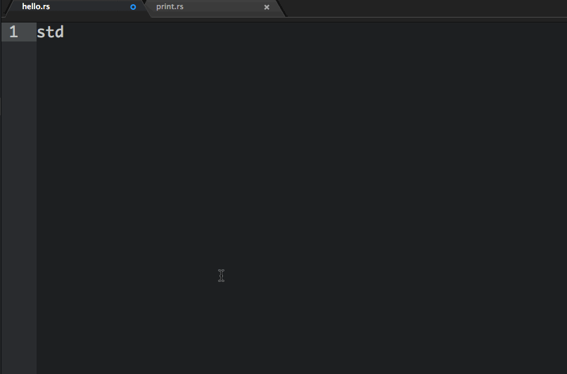

# Racer

Providing intelligent code completion for Rust, via [Racer](https://github.com/phildawes/racer) and using [Autocomplete+](https://github.com/saschagehlich/autocomplete-plus).

### Installation

First, ensure you have both [Racer](https://github.com/phildawes/racer) and [Autocomplete+](https://github.com/saschagehlich/autocomplete-plus) properly installed. Then install this package via Atom's package manager.

### Usage

